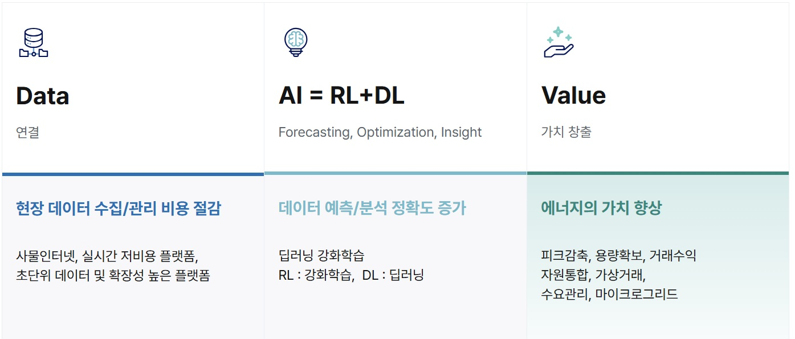
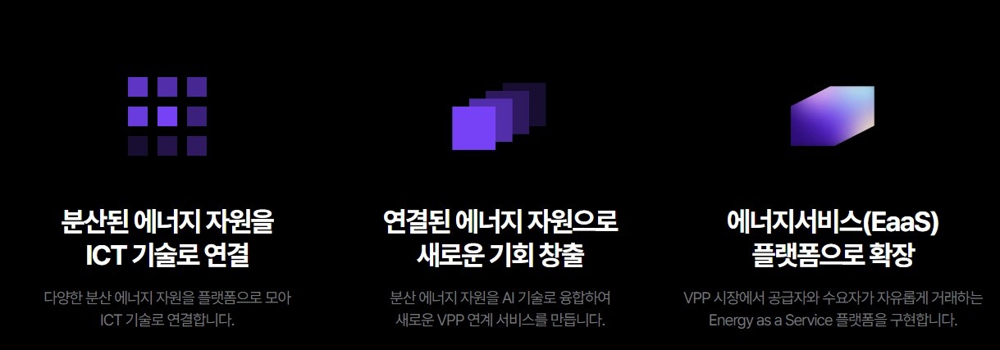

# 신재생에너지 스타트업 사례 분석
*국내외 혁신 스타드업 (에너지 쉐어링, 블록체인 탄소거래 등) 조사*

### 신재생에너지?

자연에서 지속적으로 재생되는 자원을 기반으로 한 에너지뿐만 아니라, 새로운 기술을 통해 개발된 에너지원을 포함하는 광범위한 개념이다. 

한국에서만 사용되는 용어로 국제적으로는 재생에너지로 통용된다. 즉, 한국은 기존의 재생에너지 개념에 신에너지라는 새로운 기술 기반 에너지를 포함해 이를 하나의 포괄적인 에너지 체계로 확장한 것이다.

 

  
<!-- 주석:  은 줄바꿈을 위한 Html 태그. Ctrl+/는 주석 만들기 -->
 

#### 주제 선정 사유
현재 중, 대기업에서 신재생에너지 산업에 설비 기술를 포함한 기술 발전을 하고 있지만 후발주자에 해당하는 기업은 어떤 형태로 신재생에너지 분야에 뛰어드는 지 파악하기 위함.

세계 에너지시장 정보(KETEP)에서 '2025년에 주목해야 할 최고의 에너지 기술 스타트업' 이란 기사가 나왔다.

+ 에너지 기술 스타트업 SET(Global Innovation Platform)는 2025년의 에너지 및 기후 기술 분야에서 상위 100개 스타트업을 발표

> P2H2 (미국), Botree Recycling Technologies (중국), Cyclize GmbH (독일)가 포함되며, 하이브리드 전해분해 기술, 리튬 배터리 재활용, 플라스틱 폐기물과 CO2를 합성가스로 변환하는 혁신적인 솔루션을 제공해 에너지 전환과 지속 가능한 에너지 시스템을 촉진 했다고 한다.
>> 해당 발표 사이트 <https://www.enlit.world/>

 

#### *그렇다면 국내는 어떤 형태로 신재생에너지 스타트업이 있을까*  

현재 전력망 고도화가 절실해지면서 한국전력으로 대표되는 '중앙집중식 발전과 송배전 시스템도 개선 요구'에 직면했다.

 태양광·풍력 등 발전량이 늘어나는 재생에너지는 변동성이 큰 만큼 기존 인프라로는 효율적 관리가 어렵고, 집중식 구조는 전력생산과 소비 지점 간 거리가 멀어 송전 손실이 큰 데다, 일반 소비자나 투자자들이 에너지 시장에 직접 참여할 수 있는 창구도 제한적이다.

*이에 '분산형 에너지 체계 구축'과 '에너지 투자 대중화'에 주목*

> *VPP(가상발전소)와 ESS(에너지저장시스템) 분야 스타트업들이 각광 받을 전망이다.*

[해당 기사](https://www.mt.co.kr/future/2025/09/02/2025082216262916344)

 

### 실제 기업 사례

 - 그리드위즈: 데이터 기반 수요반응(Demand Response, DR) 솔루션
> 전력수요반응제도(DR제도), 또는 '수요 관리'는 전력 회사가 전기 사용자의 전기 소비를 조정하도록 유도하기 위해 시행하는 프로그램

> 가격 또는 전기요금 인하와 같은 인센티브를 제공하여 피크 수요를 줄이거나 피크가 아닌 시간대로 전환하는 방식이며 보험과 유사한 점이 있다. 

> [관련 정보](https://www.enelx.com/kr/ko/question-and-answer/what-is-demand-response)

- 인코어드는 IoT(사물인터넷) 기술과 AI(인공지능) 분석을 결합한 에너지 데이터 관리·최적화 기술

> 독자적 HW 아키텍처와 AI 중심 알고리즘 설계(MLOps 프레임워크를 기반)

물론 에너지 투자 영역에서도 여러 스타트업들이 활약하고 있다.

- 에이치에너지 : 에너지 투자 플랫폼 '모햇'

>개인의 투자금(협동조합)으로 빈 옥상에 태양광 발전소를 건설하고 여기에서 생산한 전력을 전력시장이나 한전 자회사에 판매한 수익을 조합원에게 배분

- 엔라이튼 : 태양광 사업주-시공사-투자기관을 연결해 개발부터 금융·중개·운영관리까지 전 밸류체인을 아우르는 종합 솔루션을 제공

>자체 개발한 자산관리 시스템으로 운영·유지보수부터 소규모 전력중개, 재무·사무 관리까지 지원해 운영 효율과 수익 가시성을 높인다.

 

### 이런 기업 형태가 나오게 된 경위?

재생에너지는 기후적, 지리적 제약을 받는 경향이 있고, 대표적인 재생에너지인 태양광 발전소의 경우 매시간 생산하는 전기의 양을 예측할 수 없다. 

**따라서 실시간으로 변화하는 태양광 발전량을 예측할 수 있다면 최적 운영이 가능하다.** 또한 발전소의 위치가 대부분 사람이 상주하지 않는 외진 장소이므로 멀리서도 감시 및 운영이 가능한 스마트폰 어플 등 IT 서비스의 공급이 필수적이다.

이와 관련하여 국내 에너지 스타트업의 근간이 되는 키워드는 **데이터와 모바일/웹 서비스**이며, 이에 국내 에너지 스타트업은 대부분 IT 기업의 형태로 창업을 하게 되었다.

 

이러한 발전에도 다른 시각이 존재하기 마련이며 한 칼럼을 통해 발견한 것을 정리했다.

#### 국내 에너지 스타트업의 한계

국내 에너지 스타트업의 경우 IT기반으로 창업을 하였으나 수익창출에 한계가 있는데, 해외와 다르게 국내 시장구조는 S/W에 비용을 지불하지 않으려는 문화에서 기인한다.

 국내의 경우 한전이라는 단일 전력회사가 전기를 공급하고 전기요금도 한가지 밖에 없다. 
 
 이에 반해 해외 일부 국가는 전기 공급이 민간이기 때문에, 기호에 맞게 한전1, 한전2 등등 서비스를 제공하는 회사에서 전기를 살 수 있다. 이것이 해외 전력회사들이 스마트폰 어플 등 좋은 서비스를 소비자에게 제공하려고 노력하는 이유가 되기도 한다. 

국내는 전기요금 단가가 시간과 장소에 관계없이 일정하다. 이에 반해 해외의 경우 매 시간마다 전기요금이 달라지고 시장원리에 의거해 전기를 많이 사용할 때는 요금이 비싸고 전기 사용량이 적을 때는 싼 요금을 지불하는 것이 당연한 원리라서 수익 변동이 있다.

*그럼 이런 배경이 어떤 식으로 나타나는가?*

- 국가 기반시설과 연관된 형태로 사업 전개
> 에너지 스타트업의 경우 에너지 빅데이터 플랫폼이라는 캐치프레이즈가 대두되는 등 진보된 IT 기술을 이용하지만, 통상적인 스타트업과는 달리 소프트웨어만이 아닌 발전소와 한전 전력망 같은 국가 기반시설과 연관된 형태로 사업을 전개할 수밖에 없다.
**근본적으로 하드웨어의 한계를 벗어날 수는 없는 사업군인 것이다.** 
 
>이에 현실적으로 콘텐츠나 쇼핑플랫폼 등 스타트업처럼 기하급수적으로 시장을 확장하는 것에는 한계가 있어 결국 소프트웨어 기술만으로 승부하기 보다는 하드웨어, 인프라, 법과 제도, 영업 등 다양한 분야에 대한 노하우가 필요한 산업이다.
>>[출처](https://kvicnewsletter.co.kr/page/view.php?idx=137)