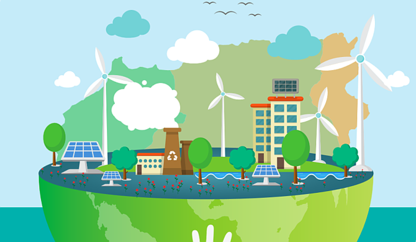

# 신재생에너지 과제 1

### 지원동기
- 현 사회에서 지속적으로 투자하는 분야, 잠재성을 지녔다.
- 지금보다 더 발전하고 싶기 때문에.
- 활용하는 프로그램을 포함해 이전부터 배우고 싶었던 기술을 갖고 있어 타 분야에서도 활용 가능성을 지녔다.

*신재생에너지 하면 떠오르는 이미지*

#### 응원 한마디
목표보다 그 이상을 얻을 수 있기를 바랍니다.